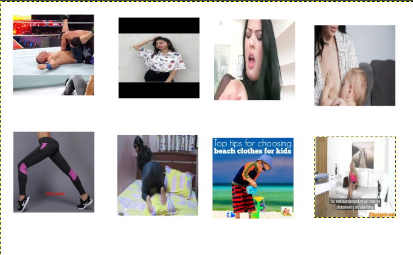
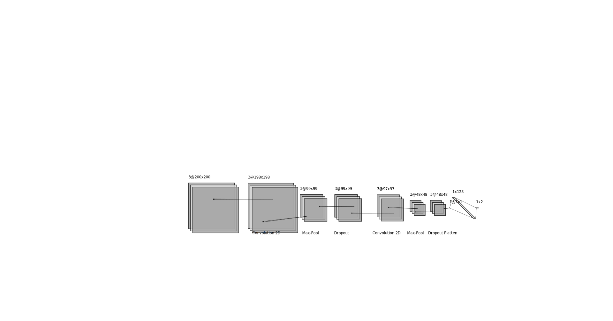

# teddy bear filter

Teddy Bear Filter é um Bot no telegram que recebe uma imagem e diz se é ou não um conteúdo pornográfico.
Caso seja pornografia o Bot substitui a foto enviada por um ursinho :).
Esse filtro foi pensado para crianças e esse bot é apenas um protótipo.
[apresentação](Teddy%20Bear%20Filter.pdf)

## instalação dos pacotes necessários

```bash
pip install -r requirements.txt 
```

__OBS:__ versão do python utilizada foi a 3.7.5

## Base de dados utilizada

Para o treinamento dessa Deep learning foi utilizado duas bases de dados.

- A primeira foi uma base de dados do pornHub publicada no Kaggle.  
[Porn Data kaggle](https://www.kaggle.com/ljlr34449/porn-data).

- A segunda base de dados, dados não pornográficos foi construída minerando fotos do google images.

## Baixando o Porn Data

Para baixar esse dataset, eu criei o script [porn_dataset.py](porn_dataset.py). Nele eu utilizei os seguintes pacotes python:

- csv
- requests
- os
- time
- concurrent
- kaggle

A maioria dos pacotes são nativos do python então você não tem que se preocupar com isso apenas se atentar que  eu utilizei
o python na versão __3.7.4__.  
Já o kaggle é uma Api criada pelo pessoal do site <https://www.kaggle.com>, com o intuito para facilitar o download de datasets
e submissão deles. Mais informações você pode encontrar no  GitHub deles: [kaggle API](https://github.com/Kaggle/kaggle-api).

## Minerando Dados do Google imagens

Para baixar fotos do Google Imagens eu utilizei o python script [Google Images Download](https://github.com/hardikvasa/google-images-download).
Através dele fiz uma pesquisa pelas seguintes palavras chaves :  

- wrestling (luta livre)

- beach clothes (roupas de praia)

- swimming (natação)

- breastfeeding (amamentação)

- games (~~essa você consegue~~)

- cat (~~acredito no seu potencial~~)

- gym clothes (roupas de academia)

feito o download das imagens observei que o _Google Images Download_ criou uma pasta chamada __downloads__ e dentro dela
ele agrupou as imagens em pastas com o nome de cada palavra chave. Então criei uma nova pasta dentro da pasta __dataset__
chamada de __nonPorn__ e movi todas as imagens para ela.
  
```bash

mkdir dataset/nonPorn                     

NONPORN=../dataset/nonPorn/ 

cd downloads

mv "beach clothes"/* $NONPORN
mv breastfeeding/*  $NONPORN
mv cat/* $NONPORN
mv games/* $NONPORN
mv "gym clothes"/* $NONPORN
mv swimming/* $NONPORN
mv wrestling/* $NONPORN

cd $NONPORN

echo "Número de arquivos é $(ls | wc -l)"

```

esse script pode ser encontrando aqui  [move_files](move_files.sh).

Foi observado também que dentro do dataset existiam gifs e webps então converti os gifs e webs em imagens .jpg com esse
comando:

```bash
convert  -coalesce *.gif *.webps image.jpg
```

__OBS:__ o comando __convert__ não gera só image.jpg ele vai transformando os gits e webps em image-1.jpg, image-2.jpg,
image-3.jpg... e asim sucessivamente.

## organizando o Dataset em Train e Test

Após baixar Todas as Fotos e organiza-los em apenas duas pastas: __porn__ ,__nonPorn__ . Foi feito o script [build_database.py](build_database.py)
que utiliza os pacotes: __numpy__, __scikit-learn__, __opencv__. Para fazer o pré-processamento dos dados, sendo mais
específico, foi feito o escalonamento de todas as imagens para as dimensões 200x200, o embaralhamento dos dados e separado
os dados que serão para o treinamento e os dados para validação. Foi decido que 40% do dataset seria validação e logicamente
60% para treinamento. Ao final do script ele gera um arquivo chamado __Pornography_Database.npz__. Outro fator que deve-se
ser ressaltado é que como a base de dados é derivado de fotos aleatórias de vídeos pornôs nem sempre a foto em questão mostra
um conteúdo pornográfico.

__OBS:__ Dos dados coletados foi utilizado __8807__ deles, sendo __4406__ imagens pornográficas e __4401__ imagens não
pornográficas.

## Uma  Amostra do conjuto de dados



## Construindo o classificador

Após a construção do conjunto de dados. Foi feita a avaliação de dois classificadores para avaliar esse dataset.

- vetor de suporte de classificação não linear com kernel RBF (NuSVC)

- rede neural convolucional (CNN)

## NuSVC

O NuSVC utilizado foi o algoritmo já implementado no [scikit-learn](https://scikit-learn.org/stable/modules/generated/sklearn.svm.NuSVC.html#sklearn.svm.NuSVC)
e não apresentou bons resultados.

No vetor de suporte de classificação não linear os parâmetros foram:

| __Parâmetros__                    |__Tipo ou Valor__|
|-----------------------------------|-----------------------------|
|kernel                             | rbf                         |
|coeficiente &gamma;                | 1/120000                    |
|coeficiente 0                      |  0                          |

__OBS:___ os parâmetros da NuSVC são os valores padrões do scikit-learn. Foi experimentado outro valor para &gamma;
mas apresentou o mesmo resultado. No caso &gamma; igual a 5.

### Matrix de confusão da SVM

| nan                               |__Conteúdo não pornográfico__| __Conteúdo pornográfico__|
|-----------------------------------|-----------------------------|--------------------------|
|__Conteúdo não pornográfico__      | 0                           | 2648                     |
|__Conteúdo pornográfico__          | 0                           | 2636                     |

## CNN

Outro classificador implementado para resolver o problema foi a CNN. Para implementar a CNN foi utilizado a biblioteca
[keras](https://github.com/keras-team/keras). Através do keras foi construído uma CNN semelhante ao exemplo usado no
[mnist_cnn.py](https://github.com/keras-team/keras/blob/master/examples/mnist_cnn.py). A CNN possuí a seguinte configuração:



| __Camadas__                       |__Tipo__|
|-----------------------------------|-----------------------------|
|0°                                 | Imagem  (200x200)           |  
|1°                                 | Conv 2D                     |
|2°                                 | Max Pool 2D                 |
|3°                                 | Drop Out                    |
|4°                                 | Conv 2D                     |
|5°                                 | Max Pool 2D                 |
|6°                                 | Drop Out                    |
|7°                                 | Flatten                     |
|8°                                 | Dense                       |
|9°                                 | Dense                       |

O otimizador utlizado foi [ADADELTA](https://arxiv.org/abs/1212.5701) e a função perda foi a
[categorical_crossentropy](https://peltarion.com/knowledge-center/documentation/modeling-view/build-an-ai-model/loss-functions/categorical-crossentropy)
que são parâmetros recomendados para problemas de classificação binária. Após o treinamento foi realizado avaliação da CNN.
Ela acertou  5207 de 5284 amostras. Dando uma precisão de __96.9%__ do conjunto de dados.

### Gráfico de treinamento e Validação


### Matrix de confusão da CNN

| nan                               |__Conteúdo não pornográfico__| __Conteúdo pornográfico__|
|-----|-----------------------------|--------------------------------------------------------|
|__Conteúdo não pornográfico__      | 2576                        | 72                       |
|__Conteúdo pornográfico__          | 94                          | 2542                     |

### Comparação entre CNN e NuSVC

| nan     |__Precisão__|
|---------|------------|
|__NuSVC__| 49.9%      |
|__CNN__  | 96.9%      |  

Vale Ressaltar que ao olhar a matrix de confusão da __NuSVC__, pode-se perceber que ela praticamente chutou que todas as
amostras eram imagens pornográficas. Com base nesse comportamento podemos afirmar que ela é um péssimo classificador. O que
ao contrário da CNN, que demonstrou ser promissor e talvez com uma base de dados maior possa ter melhores resultados. Como
Já mencionando anteriormente, os dados minerados nem sempre são verídicos, ou seja, existem imagens classificadas como
pornográficas mans não necessariamente possui conteúdo pornográfico, logo um algoritmo tem que acerta 100% desse conjunto
de dados não seria algo positivo.

## Telegram bot

Como exemplo de aplicação para o filtro de pornografia, foi feito um bot no telegram chamado [TeddyBearFilter](https://t.me/teddyBearFilterBot).
O código fonte Bot pode ser encontrado na pasta [telegramBot](telegramBot). Esse bot é capaz de baixar a imagem enviada e
enviar via socket para o um servidor. Servidor esse que possui um CNN a qual faz a predição da imagem e envia para Bot se
a imagem é pornográfica ou não.Caso a imagem é pornográfica o Bot substitui a imagem por um urso fofinho. O código do servidor pode ser encontrado aqui : [servidor](telegramBot/server.py).
Para mostrar o funcionamento do bot foi feito um vídeo:  
[Teddy em Ação](https://photos.app.goo.gl/XVRjZMxWd61DUhsC6)

## Conclusões

Apesar dos resultados satisfatórios da CNN. Como toda técnica de aprendizado de máquina, a CNN é limitada ao conjunto de
dados. Um vez que foi ligado o bot, enviamos prints de sites pornográficos para ele, mas o Bot não soube reconhecer que se
tratava de pornográfica. O bot só reconhecia que o conteúdo era pornográfico quando era retirado imagens dentro dos vídeos
pornográficos. Futuramente quem sabe eu não aprimoro o conjunto de dados :).
